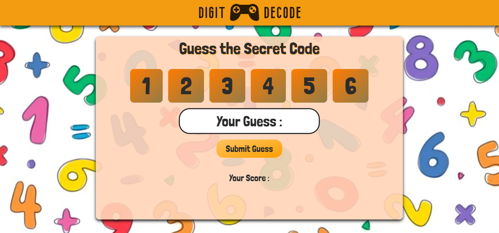

# Digit Decode - Guess The Secret Code
## 🚀 Overview
Digit Decode is a fun and interactive browser-based puzzle game inspired by classic code-breaking games like Mastermind. The objective is simple but challenging: guess a 4-digit secret code within multiple attempts using logical deduction.
 
Each digit ranges from 1 to 6, and no digit repeats in the secret code. After every guess, the game provides smart feedback using Black Pegs and White Pegs, helping the player refine their next attempt.
 
The project is built entirely with vanilla HTML, CSS, and JavaScript, focusing on clean UI, smooth animations, and clear game logic. It is lightweight, beginner-friendly, and runs directly in the browser without any external dependencies.

 

## 🚀 Screenshots

 

## 🚀 Features
- Clean and minimalistic layout resembling Netflix's UI
- Static content and sections such as the hero section, categories, and footer
- Built with vanilla HTML, CSS, and JavaScript

 

## 🚀 Tech Stack
- **HTML5** – Structure and layout of the game
- **CSS3** – Styling, animations, responsiveness, and UI effects
- **JavaScript (Vanilla)** – Game logic, DOM manipulation, event handling, and scoring algorithm
- **Google Fonts** – Custom typography (Londrina Solid)

 

## 🚀 Deployment
The app is deployed on <b>Vercel</b> and can be accessed via:
 
https://digit-decode.vercel.app/

 

## 🚀 Contact
- LinkedIn: www.linkedin.com/in/ibadhussain